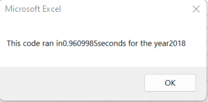

# An Analysis of Green Energy Stocks

### Purpose
An analysis of stock data from green energy companies was conducted to determine which companies would be a good investment. Data was extracted from several different green energy companies throughout the years of 2017 and 2018 for this analysis.

## Analysis and Results

### Analysis of Stock Performance between 2017 and 2018
The stock performance in 2017 overall for the green energy companies being observed was very good. Most of the companies saw high percentages of positive returns during 2017 except for TERP, which seemed to have a percentage of negative reurtns instead. As for stock performance in 2018, the overall returns were relatively worse compared to 2017. Most companies saw a large drop of returns compared to the previous year, falling into the range of negative returns. However, two companies, ENPH and RUN did have decently high percentages of positive returns compared to their competitors. In summary, green energy companies had better positive returns in 2017 for stocks.

### Analysis of Execution times between original and refactored scripts
The refactored script for analysis ran relatively faster than the original. 

